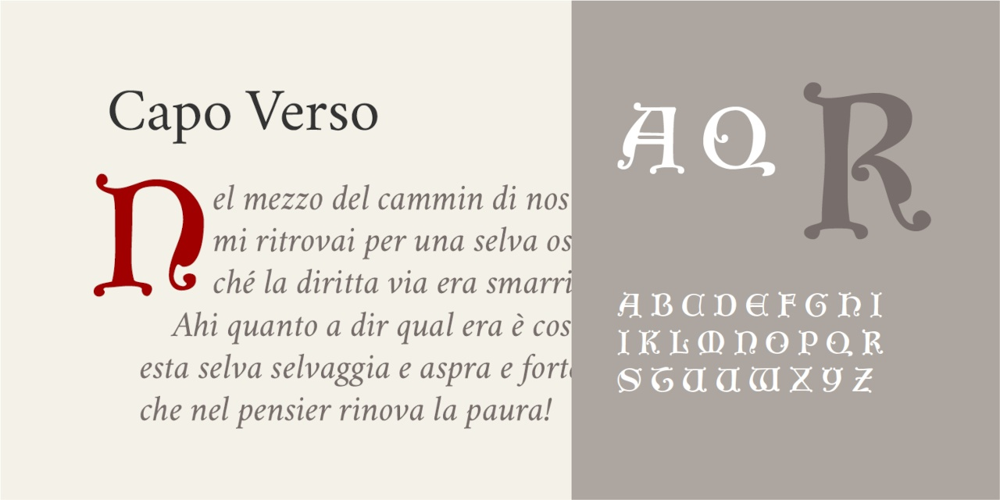

# Capo Verso
* Versione 1.0: versione iniziale

Per testare il font, vedere la [pagina interattiva](https://m-casanova.github.io/CapoVerso/).

## Descrizione

_Capo Verso_ è un font basato su [un esempio di caratteri Tudor](https://archive.org/details/examplesofletter0000jlit/page/38/mode/2up), ma con alcune modifiche.

Trattandosi di un capolettera, sono presenti solo le lettere maiuscole.
